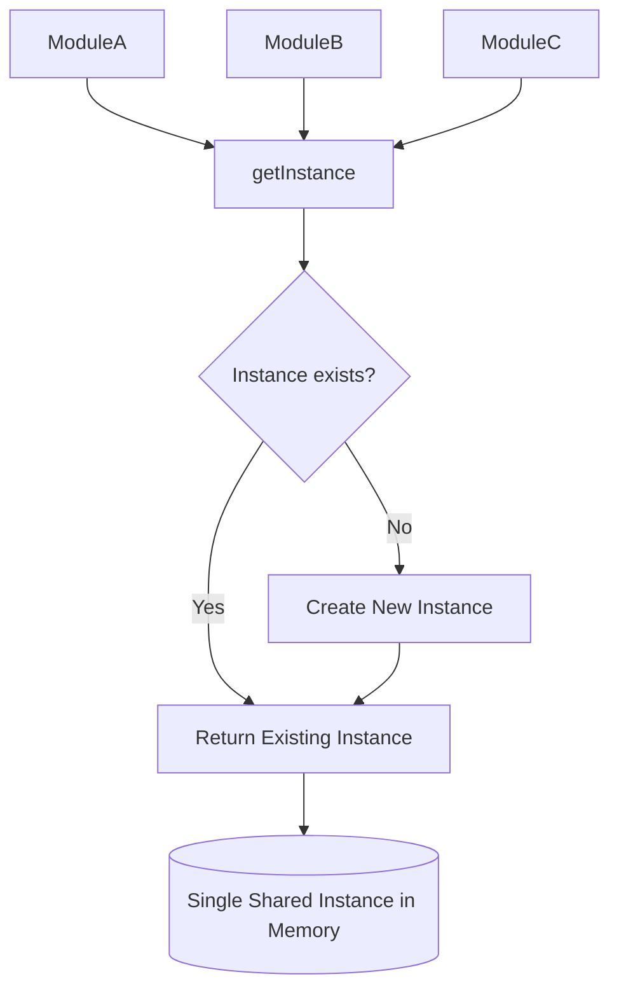

# Singleton Pattern
> **Category:** Creational Design Pattern  
> **Difficulty:** ⭐⭐☆☆☆  
> **Last Reviewed:** 2026-02-18

---

## ⚡ Quick Summary
A class that allows only one instance of itself to exist throughout the application's lifetime.  
Use it when exactly one shared object must coordinate actions across the entire system.

---

## 🏠 Real-World Analogy
Think of a **country's government**. No matter how many citizens exist, there is only
**one official government** at any given time. Every citizen interacts with the same
government — you cannot accidentally create a second government running in parallel.
All requests, laws, and decisions flow through that single, shared institution.

The Singleton Pattern works exactly the same way:
**one instance, globally accessible, created once, shared everywhere.**

---

## 📖 Theory — What & Why

**What it is:**  
A creational design pattern that restricts a class to having only one instance
throughout the application's lifetime, while providing a global access point to that instance.

**Problem it solves:**  
In large-scale systems, some resources are expensive to create or must be shared
consistently — database connection pools, configuration managers, logging services,
thread pools, or cache managers. Without Singleton, every module spinning up its own
instance of these would cause resource exhaustion, inconsistent state, and race conditions.

**Real-world usage (Big Tech):**  
- **Google:** Their internal configuration service (analogous to Firebase RemoteConfig)
  uses a single shared config instance per application runtime.
- **Java's `Runtime.getRuntime()`** — the JVM itself enforces a single Runtime instance per process.
- **Node.js module caching** — Node's `require()` system naturally caches modules,
  making every exported object a de-facto Singleton.

---

## 🗺️ Architecture Diagram


---

## 💻 Implementations

| Language   | Scenario                        | File |
|------------|---------------------------------|------|
| TypeScript | Config Manager — SaaS App       | [typescript/ConfigurationManager.ts](./typescript/ConfigurationManager.ts) |
| Java       | DB Connection Pool — Banking App | [java/ConnectionPoolManager.java](./java/ConnectionPoolManager.java) |

---

## ⚖️ Trade-offs & Bottlenecks

| Dimension | Problem | Fix |
|-----------|---------|-----|
| Testability | Global state makes unit testing hard — cannot inject mocks easily | Use a DI container (Spring, NestJS); register Singleton there so it can be swapped in tests |
| Thread Safety | Without `volatile` + double-checked locking, two threads may create two instances | Always use DCL in Java; TypeScript is safe due to single-threaded event loop (be cautious with Worker Threads) |
| Hidden Coupling | Calling `getInstance()` directly creates invisible dependencies across the codebase | Inject the singleton via constructor parameters to make dependencies explicit |
| Subclassing | Private constructor prevents inheritance | Acceptable for infrastructure classes — document this constraint clearly |
| Distributed Systems | Singleton = one instance **per process**. In a 50-pod cluster you have 50 "singletons" — not globally unique | Use Redis, etcd, or AWS Parameter Store as the true source of truth; each pod's Singleton acts as a local read-through cache |

---

## 🚨 Common Mistakes to Avoid
- Skipping `volatile` on the instance field in Java — causes subtle, hard-to-reproduce bugs under concurrency
- Using Singleton for everything — it is a tool for shared infrastructure, not general business logic
- Not protecting against reflection-based instantiation in Java (add `readResolve()`)
- Confusing Node.js module-level exports (implicit singleton) with an explicit class-based Singleton

---

## 🔗 Related Concepts
- `02_Factory` — Factory Pattern often uses a Singleton registry to manage created instances
- `Dependency Injection` — the modern, testable alternative to pulling a Singleton directly
- `Multiton Pattern` — a controlled variation that allows a fixed number of named instances

---

## ❓ Knowledge Check (Answer from memory before reading answer)

> You are building a multi-tenant SaaS application deployed across 12 horizontal pods.
> Each pod uses a Singleton `RateLimiter` that tracks API requests per user (max 100/min).
> A power user hits Pod-3 for 60 requests, then Pod-7 for 60 requests —
> your rate limiter allows both, giving them 120 requests total.
>
> **Why does the Singleton pattern fail here, and what architectural change
> would you make to fix it — without abandoning the Singleton pattern within each pod?**

**Hint (reveal only if stuck):**  
Think about where the request count state lives — is it in memory or shared storage?

---

### **Answer:**  

**Why it fails:**  
The Singleton pattern guarantees only one instance **per process (per pod)**.  
In a horizontally scaled system with 12 pods, you have **12 separate Singletons** —
each living in its own JVM/Node process, each with its own isolated memory.  
They have absolutely no awareness of each other.

So when the user hits Pod-3 for 60 requests, Pod-3's `RateLimiter` sees 60/100 — fine, allow.  
When the same user hits Pod-7 for 60 requests, Pod-7's `RateLimiter` sees 60/100 — fine, allow.  
**Total actual requests: 120. Your rate limit: broken.**

This is called the **"Split-Brain" problem** — multiple nodes making independent decisions
on state that should be globally shared.

---

**The Fix — Externalize the State:**  
The Singleton inside each pod should **stop storing the count in memory**.  
Instead, it should delegate all read/write operations to a **shared external store** —
most commonly **Redis** using the `INCR` + `EXPIRE` command pattern.
```
Pod-3's RateLimiter Singleton          Pod-7's RateLimiter Singleton
         │                                        │
         │  INCR user:9821:requests               │  INCR user:9821:requests
         │  EXPIRE 60 seconds                     │  EXPIRE 60 seconds
         └──────────────┬─────────────────────────┘
                        │
               ┌────────▼────────┐
               │   Redis (Single │
               │   Source of     │
               │   Truth)        │
               │                 │
               │ user:9821 → 60  │  ← Pod-3 wrote this
               │ user:9821 → 120 │  ← Pod-7 incremented, now BLOCKED
               └─────────────────┘
```

**Each pod's Singleton is preserved** — there is still exactly one `RateLimiter` instance
per pod, avoiding duplicate connections or config. But the **state it manages now lives
in Redis**, not in the pod's memory. Every pod reads and writes to the same Redis key,
giving you true global rate limiting across the entire cluster.

**Key Redis commands used:**
- `INCR user:{id}:requests` — atomically increments the counter (thread-safe by design)
- `EXPIRE user:{id}:requests 60` — auto-resets the counter after 60 seconds
- `GET user:{id}:requests` — check current count before processing the request

**Why this is the right mental model:**  
Singleton solves *"one instance per process"*.  
For *"one shared state across processes"*, you need an **external coordination layer**
(Redis, Memcached, DynamoDB) — and the Singleton becomes a clean local gateway to it.