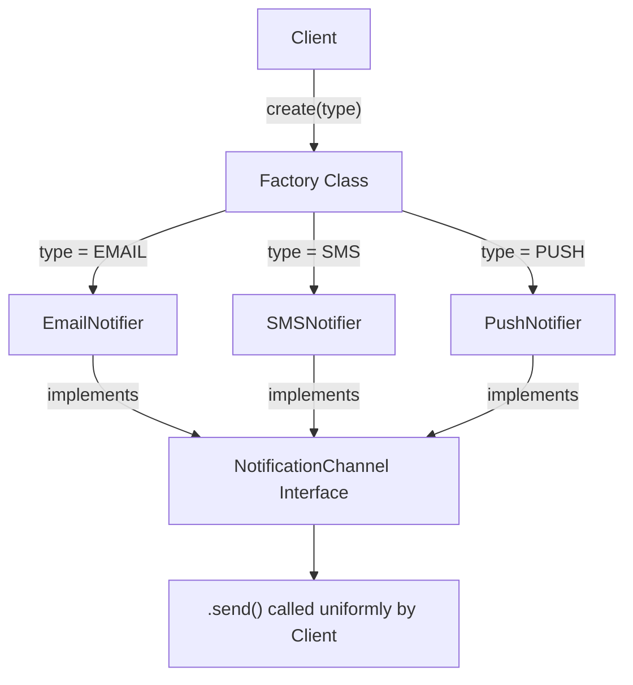

# Factory Pattern
> **Category:** Creational Design Pattern  
> **Difficulty:** ⭐⭐☆☆☆  
> **Last Reviewed:** 2026-02-18

---

## ⚡ Quick Summary
A pattern that delegates object creation to a dedicated factory class instead of using `new` directly.  
Use it when the exact type of object to create is determined at runtime, and you want the client completely decoupled from construction details.

---

## 🏠 Real-World Analogy
Think of a **vehicle manufacturing plant**. When you walk into a showroom and say
*"I want an SUV"*, you don't build the SUV yourself — you don't worry about the engine
assembly, wiring, or painting process. You just tell the showroom what you want, and
the **factory behind the scenes** figures out which machinery, workers, and parts to use,
then hands you the finished vehicle.

The Factory Pattern works exactly the same way:
**you ask for an object by type, and the factory decides how to create and return
the right one — you never deal with the construction details.**

---

## 📖 Theory — What & Why

**What it is:**  
A creational design pattern that defines an interface for creating objects, but lets
subclasses or a dedicated factory class decide which class to instantiate. The client
only talks to the factory, never to the concrete classes directly.

**Problem it solves:**  
In large systems, object creation logic becomes complex — different environments,
configurations, or user types need different implementations of the same interface.
Scattering `new ConcreteClass()` calls everywhere makes the code tightly coupled and
a nightmare to change. The Factory centralizes and hides that decision.

**Real-world usage (Big Tech):**  
- **Amazon Payment Gateway** — a factory decides whether to create a `CreditCardProcessor`,
  `UPIProcessor`, or `WalletProcessor` based on the payment method — the checkout flow never knows the difference.
- **Java's `Calendar.getInstance()`** — returns different `Calendar` subclass implementations
  depending on the locale and timezone.
- **SLF4J (Java Logging)** — `LoggerFactory.getLogger()` returns the right logger
  implementation without the caller knowing which logging backend is configured.

---

## 🗺️ Architecture Diagram


---

## 💻 Implementations

| Language   | Scenario                              | File |
|------------|---------------------------------------|------|
| TypeScript | Notification Service — SaaS App       | [typescript/NotificationFactory.ts](./typescript/NotificationFactory.ts) |
| Java       | Vehicle Dispatcher — Ride-Sharing App | [java/VehicleFactory.java](./java/VehicleFactory.java) |

---

## ⚖️ Trade-offs & Bottlenecks

| Dimension | Problem | Fix |
|-----------|---------|-----|
| Open/Closed Violation | Adding a new type means editing the factory's `switch`/`registry` — modifying existing code | Use a registry-based factory — new types self-register, factory never changes |
| Single Responsibility | Factory grows large when it handles complex construction logic for many types | Delegate heavy construction to Builder Pattern inside the factory method |
| Testing | Concrete classes created inside factory can't be easily mocked | Inject a factory interface instead of calling the static method directly; mock the factory in tests |
| Type Explosion | Too many subtypes makes the factory a long decision tree | Group related types and use Abstract Factory — a factory of factories |
| Stateless Assumption | Simple Factory assumes all products of a type are identical | If products carry unique state, pass parameters into the factory method |

---

## 🚨 Common Mistakes to Avoid
- Calling `new ConcreteClass()` directly in client code — defeats the entire purpose of the pattern
- Putting business logic inside the factory — factory must only handle creation, nothing else
- Using a giant `if-else` chain instead of a registry map — hard to extend and read
- Forgetting to throw a clear error for unknown types — silent failures are worse than loud ones
- Confusing Simple Factory (one class, one method) with Factory Method Pattern (subclasses override creation)

---

## 🔗 Related Concepts
- `01_Singleton` — Factory itself is often implemented as a Singleton so only one factory instance exists
- `03_Abstract_Factory` — A factory of factories; used when you have families of related objects
- `04_Builder` — Use Builder inside Factory when object construction requires many steps or parameters
- `Dependency Injection` — Modern frameworks use DI containers that act as smart, configurable factories

---

## ❓ Knowledge Check (Answer from memory before reading answer)

> You are extending the Ride-Sharing app. A new requirement arrives: **Premium Cab**
> must behave exactly like `Cab` but with a surge pricing multiplier that changes
> every 15 minutes based on demand.
>
> **If you add `PREMIUM_CAB` directly into `VehicleFactory`, which design principle
> are you violating and why? What is the exact change you would make to the factory
> to fix this — without touching the existing `Cab` class or the `VehicleFactory`'s
> core logic?**


**Hint (reveal only if stuck):**  
Think about the Open/Closed Principle — open for extension, closed for modification.
Can a new type register itself into the factory instead of the factory knowing about it?

## ❓ Knowledge Check (Answer from memory before reading answer)

> You are extending the Ride-Sharing app. A new requirement arrives: **Premium Cab**
> must behave exactly like `Cab` but with a surge pricing multiplier that changes
> every 15 minutes based on demand.
>
> **If you add `PREMIUM_CAB` directly into `VehicleFactory`, which design principle
> are you violating and why? What is the exact change you would make to the factory
> to fix this — without touching the existing `Cab` class or the `VehicleFactory`'s
> core logic?**

---

### **Answer**

**Which principle is violated:**  
The **Open/Closed Principle (OCP)** — one of the five SOLID principles.

> *"A class should be open for extension but closed for modification."*

By adding `PREMIUM_CAB` directly into `VehicleFactory`'s `switch` statement, you are
**modifying existing, already-tested factory code** every time a new vehicle type appears.
In a large system this means:
- Re-testing the entire factory for every new addition
- Risk of accidentally breaking existing cases (`BIKE`, `AUTO`, `CAB`)
- The factory becomes a growing, fragile god-class over time

---

**The Fix — Self-Registering Registry Factory:**  
Instead of the factory knowing about every type, **each new type registers itself
into the factory**. The factory's core logic never changes — it just looks up the registry.

**Step 1 — Change the factory to use a mutable registry:**
```java
// VehicleFactory.java — core logic never changes again
public class VehicleFactory {

    // Registry: any new vehicle type registers itself here
    private static final Map<VehicleType, Supplier<Vehicle>> registry = new HashMap<>();

    // Called by each vehicle type to register itself
    public static void register(VehicleType type, Supplier<Vehicle> supplier) {
        registry.put(type, supplier);
    }

    public static Vehicle create(VehicleType type) {
        Supplier<Vehicle> supplier = registry.get(type);
        if (supplier == null) {
            throw new IllegalArgumentException("No vehicle registered for type: " + type);
        }
        return supplier.get();
    }
}
```

**Step 2 — Create `PremiumCab` as a self-contained extension:**
```java
// PremiumCab.java — completely new file, zero changes to existing code
public class PremiumCab implements Vehicle {
    private final double surgeMultiplier;
    private static final double BASE_FARE   = 50.0;
    private static final double RATE_PER_KM = 18.0;

    public PremiumCab(double surgeMultiplier) {
        this.surgeMultiplier = surgeMultiplier;
    }

    @Override
    public String getType() { return "PREMIUM_CAB"; }

    @Override
    public double calculateFare(double distanceKm) {
        return (BASE_FARE + RATE_PER_KM * distanceKm) * surgeMultiplier;
    }

    @Override
    public void dispatch(String pickup, String drop) {
        System.out.printf("[PREMIUM_CAB] 🚖 Dispatched from '%s' to '%s' | Surge: %.1fx%n",
            pickup, drop, surgeMultiplier);
    }

    // Self-registration — this runs when the class is loaded
    static {
        VehicleFactory.register(VehicleType.PREMIUM_CAB, () -> new PremiumCab(getCurrentSurge()));
    }

    private static double getCurrentSurge() {
        // In production: fetch from a Surgepricing microservice or Redis cache
        return 1.8;
    }
}
```

**What changed:**

| | Before (Wrong) | After (Correct) |
|---|---|---|
| Adding new type | Edit `VehicleFactory.java` | Create new file only |
| Risk to existing types | High — shared switch statement | Zero — registry is isolated |
| OCP compliance | ❌ Violated | ✅ Satisfied |
| Factory awareness | Factory knows every type | Factory knows nothing about types |

**The core insight:**  
The factory should be a **dumb lookup table**, not a **smart decision maker**.
Intelligence about how to build a `PremiumCab` belongs inside `PremiumCab` itself —
not inside the factory.