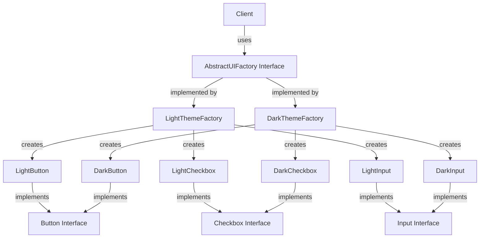

# Abstract Factory Pattern
> **Category:** Creational Design Pattern  
> **Difficulty:** ⭐⭐⭐☆☆  
> **Last Reviewed:** 2026-02-18

---

## ⚡ Quick Summary
A pattern that creates entire **families of related objects** through a single factory interface.  
Use it when objects must work together as a consistent set and you never want incompatible products mixed.

---

## 🏠 Real-World Analogy
Think of an **IKEA furniture showroom**. IKEA sells entire room collections — if you pick the
**Modern collection**, every piece you get (sofa, table, lamp) matches the modern aesthetic.
If you pick the **Classic collection**, everything matches classic style. You never mix a
modern sofa with a classic lamp — the entire family is consistent.

You don't build the furniture yourself. You just say *"I want the Modern collection"* and
IKEA's backend factory hands you a **complete, matching family of objects**.

The Abstract Factory works exactly the same way:
**instead of creating one object like a regular Factory, it creates an entire family of
related objects that are guaranteed to be compatible with each other.**

---

## 📖 Theory — What & Why

**What it is:**  
A creational design pattern that provides an interface for creating families of related
or dependent objects without specifying their concrete classes. Think of it as a
**factory of factories** — one level of abstraction above the regular Factory Pattern.

**Problem it solves:**  
In large systems you often need multiple objects that must work together as a consistent
set. If you use separate factories for each object, nothing stops a developer from
accidentally mixing incompatible implementations — a Windows button with a Mac checkbox,
or a dark-theme header with a light-theme footer. Abstract Factory enforces consistency
across the entire family at the architectural level.

**Real-world usage (Big Tech):**  
- **React Native** — renders platform-specific UI components (iOS vs Android). The same
  component code produces a native iOS `UIButton` or Android `Button` depending on the
  platform factory active at runtime.
- **Java AWT/Swing** — `Toolkit.getDefaultToolkit()` returns a platform-specific factory
  that creates matching native UI widgets for Windows, Mac, or Linux.
- **AWS SDK** — uses abstract factories internally to create matching sets of service
  clients, credential providers, and retry handlers per environment.

---

## 🗺️ Architecture Diagram


---

## 💻 Implementations

| Language   | Scenario                                  | File |
|------------|-------------------------------------------|------|
| TypeScript | UI Theme Engine — SaaS Dashboard          | [typescript/UIThemeFactory.ts](./typescript/UIThemeFactory.ts) |
| Java       | Multi-Database ORM Engine — FinTech App   | [java/DatabaseFactoryProvider.java](./java/DatabaseFactoryProvider.java) |

---

## ⚖️ Trade-offs & Bottlenecks

| Dimension | Problem | Fix |
|-----------|---------|-----|
| Adding a new product | Requires changing Abstract Factory interface AND every concrete factory | Keep families small and stable; accept this as the fundamental trade-off |
| Class explosion | N families × M products = N×M concrete classes | Group only tightly related products; extract shared logic into abstract base classes |
| Rigidity | Assumes all families have identical product sets | Use optional/nullable products or capability flags for differing families |
| Overkill for small systems | Too much ceremony for 2 families, 2 products | Use Abstract Factory only when you have 2+ families with 2+ related products each |
| Runtime family switching | Switching factories mid-session requires rebuilding all components | Hold products behind a reactive state layer; re-inject new factory and re-render |

---

## 🚨 Common Mistakes to Avoid
- Confusing Abstract Factory (family of objects) with Factory Method (one object, subclass decides)
- Making the Abstract Factory interface too large — every new product type breaks all existing factories
- Mixing products from different factories — defeats the entire purpose of the pattern
- Using Abstract Factory when a simple Factory would suffice — over-engineering kills readability
- Forgetting to inject the factory into the client — hardcoding `new ConcreteFactory()` in the client reintroduces coupling

---

## 🔗 Related Concepts
- `02_Factory` — Abstract Factory is one level above Factory; Factory creates one object, Abstract Factory creates a family
- `04_Builder` — Use Builder when constructing complex individual products inside the factory methods
- `01_Singleton` — Concrete factories are often Singletons since only one factory instance per family is needed
- `Dependency Injection` — DI containers are essentially configurable Abstract Factories at framework level

---

## ❓ Knowledge Check (Answer from memory before reading answer)

> Your FinTech platform is expanding. A new requirement says the platform must now support
> a **third database — Cassandra** — for high-write time-series transaction logs,
> alongside the existing PostgreSQL and MongoDB.
>
> **Walk me through exactly which files/classes you create and which you modify
> to add Cassandra support. Then explain: if you also need to add a brand new product
> — a `MigrationRunner` interface — to all three factories, how does that change
> your answer, and which design principle does this addition stress?**

---

### **Answer**

#### Part 1 — Adding Cassandra (a new Family)

This is where Abstract Factory shines. Adding a new **family** requires:

**Files you CREATE (zero modifications to existing code):**
```
CassandraConnection.java        ← implements DBConnection
CassandraQueryBuilder.java      ← implements QueryBuilder
CassandraTransactionManager.java ← implements TransactionManager
CassandraDatabaseFactory.java   ← implements DatabaseFactory
```

**Files you MODIFY (minimal, surgical):**
```java
// DatabaseType.java — add one enum value
enum DatabaseType { POSTGRES, MONGODB, CASSANDRA }  // ← add CASSANDRA

// DatabaseFactoryProvider.java — add one switch case
case CASSANDRA -> new CassandraDatabaseFactory();   // ← add this line
```

That is it. The `DatabaseFactory` interface, `PaymentRepository`, `PostgresDatabaseFactory`,
and `MongoDatabaseFactory` are **completely untouched**. This is the Open/Closed Principle
working perfectly — open for extension (new family), closed for modification (existing families).

---

#### Part 2 — Adding MigrationRunner (a new Product)

This is where Abstract Factory shows its **fundamental weakness**. Adding a new product
to the family requires touching every single existing class in the hierarchy:

**Files you CREATE:**
```
MigrationRunner.java                  ← new abstract product interface
PostgresMigrationRunner.java          ← implements MigrationRunner
MongoMigrationRunner.java             ← implements MigrationRunner
CassandraMigrationRunner.java         ← implements MigrationRunner
```

**Files you MODIFY (this is the pain point):**
```
DatabaseFactory.java                  ← add createMigrationRunner() to interface
PostgresDatabaseFactory.java          ← implement createMigrationRunner()
MongoDatabaseFactory.java             ← implement createMigrationRunner()
CassandraDatabaseFactory.java         ← implement createMigrationRunner()
```

**Which principle is stressed:**  
The **Interface Segregation Principle (ISP)** — clients that don't use `MigrationRunner`
are now forced to depend on an interface that contains it. Every factory must implement
a method that may be irrelevant to some consumers.

**Which principle is violated:**  
The **Open/Closed Principle (OCP)** — you are modifying the `DatabaseFactory` interface
(existing code) to accommodate the new product, which risks breaking all existing
implementations if not handled carefully.

**The practical fix:**  
Split the factory into smaller, focused interfaces:
```java
interface DatabaseFactory      { DBConnection createConnection(); QueryBuilder createQueryBuilder(); }
interface TransactionalFactory { TransactionManager createTransactionManager(); }
interface MigratableFactory    { MigrationRunner createMigrationRunner(); }

// Only factories that support migrations implement MigratableFactory
class PostgresDatabaseFactory implements DatabaseFactory, TransactionalFactory, MigratableFactory { ... }
class MongoDatabaseFactory    implements DatabaseFactory, TransactionalFactory, MigratableFactory { ... }
class CassandraDatabaseFactory implements DatabaseFactory { ... } // Cassandra skips migration
```

This way clients that only need a connection never see `MigrationRunner`,
and adding new products no longer forces every factory to implement everything.

**The golden rule to remember:**  
> Adding a new **family** to Abstract Factory = easy (OCP respected).  
> Adding a new **product** to Abstract Factory = painful (touches every factory).  
> Design your product interfaces to be **stable** — families can grow freely, products should not.