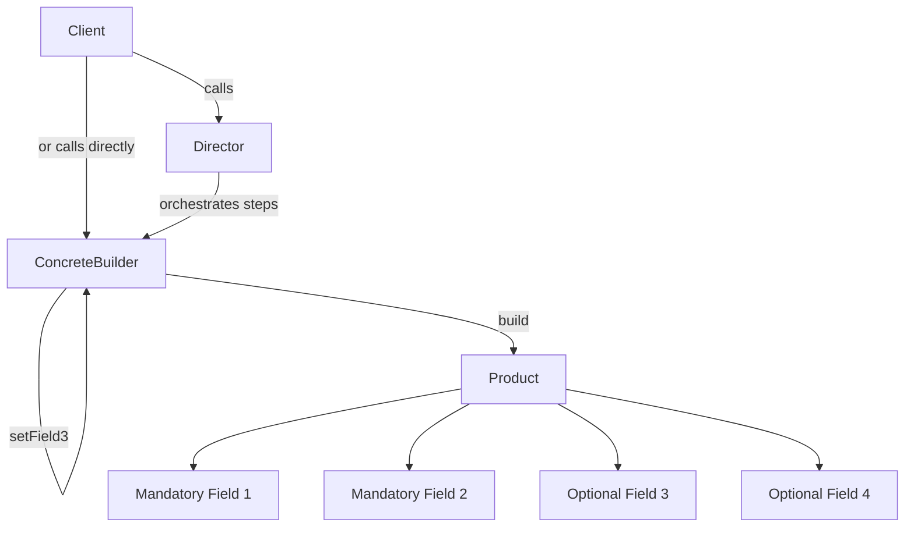

# Builder Pattern
> **Category:** Creational Design Pattern  
> **Difficulty:** ⭐⭐⭐☆☆  
> **Last Reviewed:** 2026-02-18

---

## ⚡ Quick Summary
A pattern that constructs complex objects step by step using a fluent API, separating construction from representation.  
Use it when an object has many fields — especially optional ones — and a single constructor would be unreadable or error-prone.

---

## 🏠 Real-World Analogy
Think of **ordering a custom subway sandwich**. The staff member builds your sandwich
**step by step** — first the bread, then the protein, then the vegetables, then the sauces,
then toasting it. You don't get a pre-made sandwich. You direct each step and at the end
say *"wrap it up"* to receive the final product.

You could order a simple sandwich (just bread and cheese) or a complex one (every topping) —
the **same building process** handles both. You never worry about how the bread is baked
or how the vegetables are sliced.

The Builder Pattern works exactly the same way:
**it constructs a complex object step by step, letting you produce different representations
of the same object using the same construction process.**

---

## 📖 Theory — What & Why

**What it is:**  
A creational design pattern that separates the construction of a complex object from its
representation. A Builder class handles step-by-step assembly, and a Director (optional)
orchestrates steps in a specific order for common configurations.

**Problem it solves:**  
When an object has many optional fields, using a single constructor becomes a nightmare —
you end up with telescoping constructors like
`new User(name, null, null, true, null, "ADMIN", null)`.
This is unreadable, error-prone, and impossible to maintain.
Builder replaces this with a clean, readable, chainable construction API.

**Real-world usage (Big Tech):**  
- **Elasticsearch Query DSL** — complex search queries built step by step via a fluent builder API.
- **Java's `StringBuilder`** — the classic example; append step by step, call `toString()` at the end.
- **Lombok `@Builder`** — auto-generates builder pattern for Java POJOs across enterprise codebases.
- **AWS SDK v2** — every client and request built via builder: `S3Client.builder().region(...).build()`.

---

## 🗺️ Architecture Diagram


---

## 💻 Implementations

| Language   | Scenario                                   | File |
|------------|--------------------------------------------|------|
| TypeScript | Email Campaign Builder — Marketing SaaS    | [typescript/EmailCampaignBuilder.ts](./typescript/EmailCampaignBuilder.ts) |
| Java       | HTTP Request Builder — API Gateway Service | [java/HttpRequest.java](./java/HttpRequest.java) |

---

## ⚖️ Trade-offs & Bottlenecks

| Dimension | Problem | Fix |
|-----------|---------|-----|
| Mutability during build | Sharing a builder across threads causes race conditions | Never share a builder instance; always create fresh per object |
| Verbose for simple objects | Adds ceremony for objects with only 2-3 fields | Use Builder only when 4+ fields, especially when many are optional |
| Validation timing | Errors surface only at `build()` not at each step | Add per-step validation inside each setter; fail fast |
| Partial builds | Builder discarded halfway leaves no product | Acceptable — builder holds state only during construction; GC cleans it |
| Director coupling | Director tightly coupled to one builder type | Program Director to a Builder interface so builders can be swapped |
| Immutability | Product fields might be mutable objects (lists, maps) | Deep-copy mutable fields in the product constructor |

---

## 🚨 Common Mistakes to Avoid
- Forgetting to return `this` in builder methods — breaks method chaining entirely
- Sharing one builder instance to create multiple objects — second `build()` call produces a corrupt object
- Putting business logic inside the builder — builder constructs, it does not decide
- Not validating mandatory fields at `build()` time — silent null pointer errors downstream
- Making the product class mutable after construction — defeats the purpose of controlled building

---

## 🔗 Related Concepts
- `02_Factory` — Factory decides which object to create; Builder decides how to construct it. Often used together
- `03_Abstract_Factory` — Abstract Factory can use Builders internally for complex product construction
- `Fluent Interface` — Builder is the most common application of the Fluent Interface design principle
- `Lombok @Builder` — Java annotation that auto-generates the full Builder pattern at compile time

---

## ❓ Knowledge Check (Answer from memory before reading answer)

> You are building a `ReportBuilder` for a BI platform.
> A report has: a mandatory title, mandatory date range, optional filters,
> optional chart types, optional export format (PDF/CSV/Excel),
> and an optional email to send the report to.
>
> **A junior developer suggests: "Why use Builder? We can use a single constructor
> with default `null` values for optional fields and let callers pass `null`."**
>
> **Make the case against this approach using at least 3 concrete technical arguments.
> Then show the method signature of the constructor they propose vs the builder API
> you would write — just the signatures, no full implementation needed.**

**Your Answer (fill this after attempting):**  
...

---

### ✅ Model Answer

#### The Junior Developer's Proposed Constructor
```java
// What the junior dev proposes — this is the problem
public Report(
    String        title,           // mandatory
    DateRange     dateRange,       // mandatory
    List<Filter>  filters,         // optional — caller passes null
    List<String>  chartTypes,      // optional — caller passes null
    ExportFormat  exportFormat,    // optional — caller passes null
    String        recipientEmail   // optional — caller passes null
) { ... }

// How every caller looks — unreadable and dangerous
new Report("Sales Q1", range, null, null, ExportFormat.PDF, null);
new Report("Traffic",  range, null, List.of("BAR"), null,  null);
new Report("Revenue",  range, filters, null, null, "cfo@company.com");
```

#### The Builder API You Would Write
```java
// What Builder gives you — readable, safe, self-documenting
Report report = new ReportBuilder()
    .title("Sales Q1")                    // mandatory — clear
    .dateRange(startDate, endDate)        // mandatory — clear
    .addFilter("region", "APAC")          // optional — only set when needed
    .exportAs(ExportFormat.PDF)           // optional — only set when needed
    .emailTo("cfo@company.com")           // optional — only set when needed
    .build();
```

---

#### 3 Concrete Technical Arguments Against the Null Constructor

**Argument 1 — Positional parameter errors are silent and catastrophic**  
With 6 parameters, callers must remember the exact position of each argument.
Swapping `exportFormat` and `recipientEmail` is a valid compile-time call but produces
a completely wrong runtime object. The compiler cannot catch this.
With Builder, every field is named at the call site — transposing two fields is impossible.
```java
// Both compile — only one is correct. Can you spot the bug instantly?
new Report("Revenue", range, null, null, "cfo@company.com", ExportFormat.PDF);
new Report("Revenue", range, null, null, ExportFormat.PDF, "cfo@company.com");
```

**Argument 2 — Null propagation causes unpredictable NullPointerExceptions**  
When a caller passes `null` for `filters`, every downstream method that touches `filters`
must defensively null-check it — forever. If one method forgets, you get a NPE at runtime
far from the construction site, making it very hard to debug.
Builder initializes optional fields to safe empty defaults (`new ArrayList<>()`, `Optional.empty()`)
inside the builder itself — the product is always in a valid, non-null state after `build()`.

**Argument 3 — Telescoping constructors do not scale**  
Today the report has 6 fields. Next quarter it needs 3 more optional fields — `theme`,
`pageSize`, `watermark`. With the null constructor you now have a 9-parameter constructor.
Every existing caller must be updated to pass 3 more `null` arguments in the right positions.
With Builder, you add 3 new setter methods — zero existing callers change, and new callers
opt into the new fields only if they need them.

**Bonus — Argument 4 — Builder enables staged validation**  
With the null constructor, validation of the full object happens inside the constructor
or not at all. With Builder, you can validate each field at the setter level (fail fast)
AND validate cross-field rules at `build()` time (e.g., "if exportFormat is PDF,
pageSize must be set"). The null constructor makes this cross-field validation awkward
and buried deep inside a single overloaded constructor body.