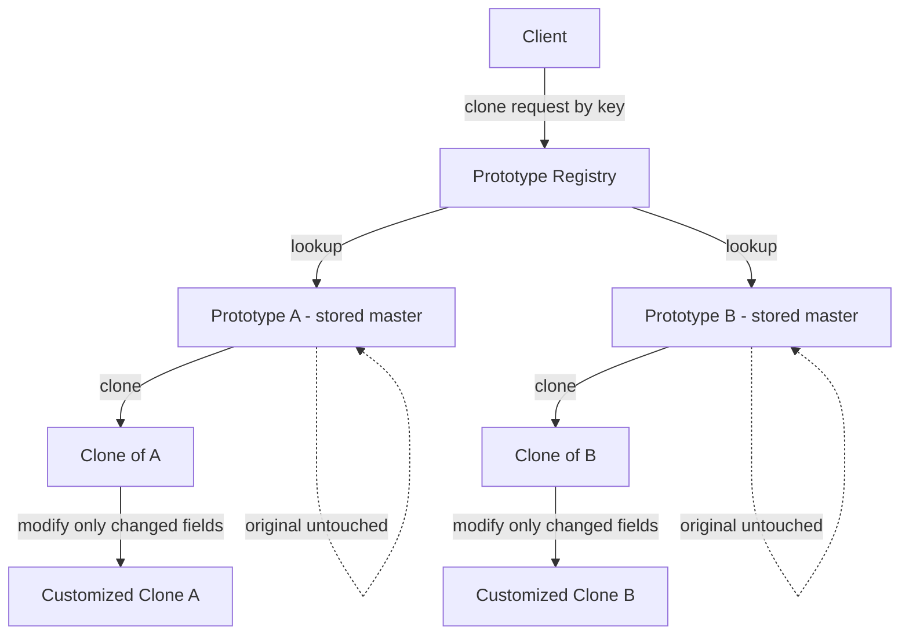

# Prototype Pattern
> **Category:** Creational Design Pattern  
> **Difficulty:** ⭐⭐⭐☆☆  
> **Last Reviewed:** 2026-02-23

---

## ⚡ Quick Summary
A pattern that creates new objects by cloning an existing object (the prototype) instead of constructing from scratch.  
Use it when object creation is expensive and many similar objects are needed with minor variations.

---

## 🏠 Real-World Analogy
Think of a **photocopier in an office**. You have one master document — perfectly formatted,
with the right fonts, margins, headers, and signatures. Instead of retyping it from scratch
every time you need a copy, you place it on the copier and press the button.
You get an identical copy instantly. You can then write notes on that copy without
affecting the original master.

The Prototype Pattern works exactly the same way:
**instead of creating a new object from scratch through an expensive construction process,
you clone an existing object, get an identical copy, and modify only what you need.**

---

## 📖 Theory — What & Why

**What it is:**  
A creational design pattern that creates new objects by copying (cloning) an existing
object — called the prototype — rather than constructing a new one using `new`.
The cloned object is fully independent of the original.

**Problem it solves:**  
Object creation is sometimes extremely expensive — involving database calls, network
requests, complex calculations, or deep configuration. If you need 50 similar objects
that differ only slightly, creating each from scratch wastes resources. Prototype lets
you create one expensive object once, then clone it cheaply as many times as needed.

**Real-world usage (Big Tech):**  
- **JavaScript's object system** — `Object.create(proto)` implements Prototype Pattern at language level.
- **Game engines (Unity/Unreal)** — enemy characters and bullets are spawned by cloning prototypes rather than constructing each from scratch every frame.
- **Spring Framework** — beans with `scope="prototype"` return a fresh clone on every `getBean()` call.
- **Adobe Photoshop** — duplicating a layer deep clones all pixel data, effects, and metadata.

---

## 🗺️ Architecture Diagram


---

## 💻 Implementations

| Language   | Scenario                                       | File |
|------------|------------------------------------------------|------|
| TypeScript | Game Character Template System — Online RPG    | [typescript/GameCharacter.ts](./typescript/GameCharacter.ts) |
| Java       | Document Template Engine — Legal Tech Platform | [java/LegalDocument.java](./java/LegalDocument.java) |

---

## ⚖️ Trade-offs & Bottlenecks

| Dimension | Problem | Fix |
|-----------|---------|-----|
| Shallow vs Deep Clone | Shallow copy shares nested object references — modifying clone corrupts original | Always deep clone nested mutable objects using copy constructors or serialization |
| Circular references | Deep cloning circular object graphs causes infinite recursion | Track visited objects in a map during cloning; break cycle on revisit |
| Clone consistency | New fields added to class must be manually added to `clone()` | Use serialization-based cloning — automatically includes all fields |
| Hidden mutation | Caller assumes clone shares data with original | Document that clones are fully independent; use immutable value objects |
| Registry memory | Large prototypes stored in registry consume heap | Store factory lambdas instead of fully-built objects; build lazily |
| Prototype staleness | Cached prototypes become outdated when config changes | Add TTL or versioning; invalidate and rebuild prototypes on config change |

---

## 🚨 Common Mistakes to Avoid
- Using shallow clone (`{ ...obj }` or `super.clone()`) for objects with nested mutable state — this is the most common and most dangerous mistake
- Forgetting to assign a new unique ID to the clone — two objects sharing the same ID causes silent data corruption
- Storing the prototype itself in the registry without protection — if anyone gets the registry reference and mutates it, all future clones are corrupted
- Not using copy constructors for nested objects in Java — `Object.clone()` is shallow by default
- Confusing Prototype (clone existing) with Factory (construct new) — use Prototype when construction is expensive, Factory when type selection is the concern

---

## 🔗 Related Concepts
- `02_Factory` — Factory constructs new objects; Prototype clones existing ones. Use Prototype inside a Factory when construction is expensive
- `04_Builder` — Builder assembles complex objects step by step; Prototype skips assembly by copying. Use Builder for the master prototype, then clone it
- `01_Singleton` — The Prototype Registry is often implemented as a Singleton so only one registry exists per application
- `Object.create()` — JavaScript's native implementation of the Prototype Pattern at language level

---

## ❓ Knowledge Check

> You are building the Game Character system. A new **Dragon Boss** character is added.
> The Dragon Boss has a nested `SpellBook` object which contains a `List<Spell>`,
> where each `Spell` has a name, cooldown, and a `List<StatusEffect>`.
>
> **Your junior developer writes the clone method using only the spread operator
> `{ ...this }` in TypeScript (or `super.clone()` in Java without deep copying nested objects).
> Walk through exactly what goes wrong when the game spawns two Dragon Boss clones
> and the first clone learns a new spell. Then write the correct clone strategy
> for this 3-level deep nested structure.**

---

### ✅ Model Answer

#### What Goes Wrong With Shallow Clone

The object graph looks like this:
```
DragonBoss (Clone 1)  ──┐
                         ├──► SpellBook (SAME reference) ──► List<Spell> (SAME list)
DragonBoss (Clone 2)  ──┘                                        │
                                                                  ├── Fireball
                                                                  └── Ice Storm
```

When the junior dev writes `{ ...this }` in TypeScript or `super.clone()` in Java,
the top-level `DragonBoss` object is new — but `spellBook` is **copied by reference**.
Both Clone 1 and Clone 2 point to the **exact same `SpellBook` object in memory**.

When Clone 1 learns a new spell:
```typescript
clone1.spellBook.spells.push(new Spell("Meteor Strike", 30, []));
```

Clone 2 also instantly "knows" Meteor Strike — because they share the same `SpellBook`.
Worse, the **original master prototype** in the registry also has Meteor Strike now,
meaning **every future clone** spawned from the registry will start with Meteor Strike.
This is a silent, catastrophic bug that is extremely hard to trace.

---

#### The Correct 3-Level Deep Clone Strategy
```typescript
// Level 3 — clone StatusEffect (innermost)
class StatusEffect {
  constructor(
    public name:         string,
    public durationSecs: number,
    public intensity:    number
  ) {}

  clone(): StatusEffect {
    // Primitive fields only — simple spread is safe here
    return new StatusEffect(this.name, this.durationSecs, this.intensity);
  }
}

// Level 2 — clone Spell (contains List<StatusEffect>)
class Spell {
  constructor(
    public name:     string,
    public cooldown: number,
    public effects:  StatusEffect[]
  ) {}

  clone(): Spell {
    return new Spell(
      this.name,
      this.cooldown,
      this.effects.map(e => e.clone()) // Deep clone each StatusEffect
    );
  }
}

// Level 1 — clone SpellBook (contains List<Spell>)
class SpellBook {
  constructor(public spells: Spell[]) {}

  clone(): SpellBook {
    return new SpellBook(
      this.spells.map(s => s.clone()) // Deep clone each Spell
    );
  }
}

// Level 0 — clone DragonBoss (contains SpellBook)
class DragonBoss implements Cloneable<DragonBoss> {
  constructor(
    public name:      string,
    public health:    number,
    public spellBook: SpellBook
  ) {}

  clone(): DragonBoss {
    return new DragonBoss(
      this.name,
      this.health,
      this.spellBook.clone() // Deep clone SpellBook — which deep clones Spells — which deep clones StatusEffects
    );
  }
}
```

After correct deep cloning the object graph looks like this:
```
DragonBoss Clone 1  ──► SpellBook (NEW) ──► List<Spell> (NEW) ──► StatusEffects (NEW)
DragonBoss Clone 2  ──► SpellBook (NEW) ──► List<Spell> (NEW) ──► StatusEffects (NEW)
Master Prototype    ──► SpellBook (ORIGINAL — untouched forever)
```

**The golden rule:**
> For every level of nesting that contains mutable state,
> you need one explicit `clone()` call going downward.
> Primitive fields (`string`, `number`, `boolean`) are safe to copy directly.
> Any field that is an **object or array** must be explicitly deep copied.